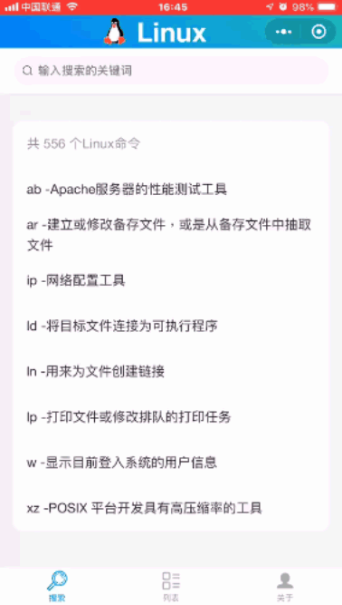

<p align="center">
  <a href="http://www.oschina.net/">
    
  </a>
</p>

Linux Command
--- 

[](https://github.com/Zming-ming/linux-command/) 

556 个 Linux 命令，内容包含 Linux 命令手册、详解、学习，非常适合学习 Linux 命令的速查手册。关于数据方面是使用别人开源的，直接使用了他们家的数据 [jaywcjlove](https://github.com/jaywcjlove/linux-command) 。这个项目还使用了 [ColorUI](https://github.com/weilanwl/ColorUI) 组件库做页面样式排版跟wemark进行对[Markdown](https://github.com/TooBug/wemark)数据进行渲染


[微信小程序](#微信小程序-版本) 

## 开发使用

通过 `git` 下载源码,然后使用微信开发者工具打开。

```
git clone https://github.com/Zming-ming/linux-command.git
```

```
# 命令索引 JSON 数据
https://github.com/Zming-ming/linux-command/utils/data.js
# 对应命令详情（Markdown）数据
https://github.com/Zming-ming/linux-command/src/markdown/<命令名称>.md.js 
```

你也可以通过 Github 的 Raw 来，获取最新的内容


#### 微信小程序 版本

微信扫描二维码直接打开程序(暂未上线)。

[](https://github.com/Zming-ming/linux-command/)

[](https://github.com/Zming-ming/linux-command/)


## 目录

- [Linux命令分类](#linux命令分类)
  - [文件管理](#文件管理) File Management
  - [文件传输](#文件传输) File Transfer
  - [文本处理](#文本处理) File Editor
  - [备份压缩](#备份压缩) File Compression
  - [系统管理](#系统管理) System Management
  - [系统设置](#系统设置) System Settings
  - [网络通讯](#网络通讯) Network Communication
  - [磁盘管理](#磁盘管理) Disk Management
  - [磁盘维护](#磁盘维护) Disk Maintenance
  - [设备管理](#设备管理) Device Commands
  - [电子邮件与新闻组](#电子邮件与新闻组)
  - [其他命令](#其他命令) Misc Commands

## Linux命令分类

*这里存放Linux 命令大全并不全，你可以通过[linux-command](https://jaywcjlove.github.io/linux-command/)来搜索，它是把 [command](./assets/command) 目录里面搜集的命令，生成了静态HTML并提供预览以及索引搜索。*

### 文件传输

bye、ftp、ftpcount、ftpshut、ftpwho、ncftp、tftp、uucico、uucp、uupick、uuto、scp

### 备份压缩

ar、bunzip2、bzip2、bzip2recover、compress、cpio、dump、gunzip、gzexe、gzip、lha、restore、tar、unarj、unzip、zip、zipinfo

### 文件管理

diff、diffstat、file、find、git、gitview、ln、locate、lsattr、mattrib、mc、mcopy、mdel、mdir、mktemp、mmove、mread、mren、mshowfat、mtools、mtoolstest、mv、od、paste、patch、rcp、rhmask、rm、slocate、split、tee、tmpwatch、touch、umask、whereis、which、cat、chattr、chgrp、chmod、chown、cksum、cmp、cp、cut、indent

### 磁盘管理

cd、df、dirs、du、edquota、eject、lndir、ls、mcd、mdeltree、mdu、mkdir、mlabel、mmd、mmount、mrd、mzip、pwd、quota、quotacheck、quotaoff、quotaon、repquota、rmdir、rmt、stat、tree、umount

### 磁盘维护

badblocks、cfdisk、dd、e2fsck、ext2ed、fdisk、fsck.ext2、fsck、fsck.minix、fsconf、hdparm、losetup、mbadblocks、mformat、mkbootdisk、mkdosfs、mke2fs、mkfs.ext2、mkfs、mkfs.minix、mkfs.msdos、mkinitrd、mkisofs、mkswap、mpartition、sfdisk、swapoff、swapon、symlinks、sync

### 系统设置

alias、apmd、aumix、bind、chkconfig、chroot、clock、crontab、declare、depmod、dircolors、dmesg、enable、eval、export、fbset、grpconv、grpunconv、hwclock、insmod、kbdconfig、lilo、liloconfig、lsmod、minfo、mkkickstart、modinfo、modprobe、mouseconfig、ntsysv、passwd、pwconv、pwunconv、rdate、resize、rmmod、rpm、set、setconsole、setenv、setup、sndconfig、SVGAText Mode、timeconfig、ulimit、unalias、unset

### 系统管理

adduser、chfn、chsh、date、exit、finger、free、fwhois、gitps、groupdel、groupmod、halt、id、kill、last、lastb、login、logname、logout、logrotate、newgrp、nice、procinfo、ps、pstree、reboot、renice、rlogin、rsh、rwho、screen、shutdown、sliplogin、su、sudo、suspend、swatch、tload、top、uname、useradd、userconf、userdel、usermod、vlock、w、who、whoami、whois

### 文本处理

awk、col、colrm、comm、csplit、ed、egrep、ex、fgrep、fmt、fold、grep、ispell、jed、joe、join、look、mtype、pico、rgrep、sed、sort、spell、tr、uniq、vi、wc

### 网络通讯

dip、getty、mingetty、ppp-off、smbd(samba daemon)、telnet、uulog、uustat、uux、cu、dnsconf、efax、httpd、ifconfig、mesg、minicom、nc、netconf、netconfig、netstat、ping、pppstats、samba、setserial、shapecfg(shaper configuration)、smbd(samba daemon)、statserial(status ofserial port)、talk、tcpdump、testparm(test parameter)、traceroute、tty(teletypewriter)、uuname、wall(write all)、write、ytalk、arpwatch、apachectl、smbclient(samba client)、pppsetup

### 设备管理

dumpkeys、loadkeys、MAKEDEV、rdev、setleds

### 电子邮件与新闻组

archive、ctlinnd、elm、getlist、inncheck、mail、mailconf、mailq、messages、metamail、mutt、nntpget、pine、slrn、X WINDOWS SYSTEM、reconfig、startx(start X Window)、Xconfigurator、XF86Setup、xlsatoms、xlsclients、xlsfonts

### 其他命令

yes